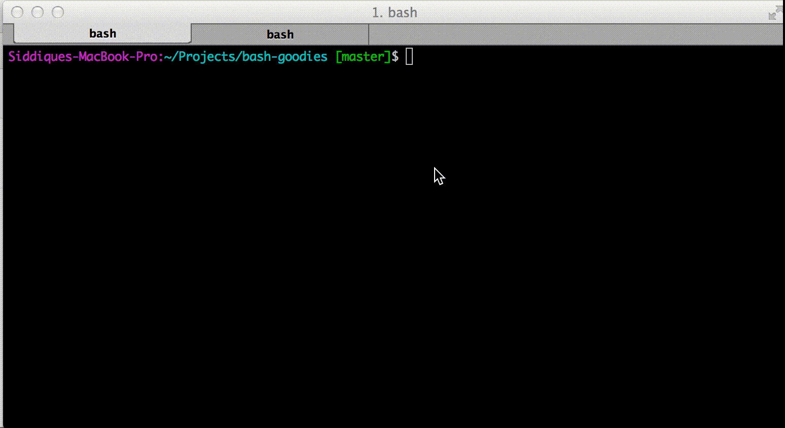

bash-goodies
=====
Collection of bash goodies for GIT & other command line awesomeness!

###Installation/Upgrade
```bash
curl https://raw.githubusercontent.com/siddii/bash-goodies/master/install.sh | sh
```

###General Commands/Aliases

```bash
serve #Runs a Python based webserver with optional port
```

```bash
pop 8080 #Finds process with open port
```

```bash
o . #Will open Finder on Mac
```

###GIT aliases

Comes with auto completion for all GIT commands & the aliases listed below
```bash
gd      #"git diff | mate"
ga      #"git add"
gbd     #"git branch -D"
gst     #"git status"
gca     #"git commit -a -m"
gm      #"git merge --no-ff"
gpt     #"git push --tags"
gp      #"git push"
grh     #"git reset --hard"
gb      #"git branch"
gcob    #"git checkout -b"
gco     #"git checkout"
gba     #"git branch -a"
gcp     #"git cherry-pick"
gl      #"git log --pretty='format:%Cgreen%h%Creset %an - %s' --graph"
gpom    #"git pull origin master"
gcd     #'cd "`git rev-parse --show-toplevel`"'
```

###Credits
The source code in this repository are collected from various sources.
Please refer to the individual script files for their origin. Thanks to those contributors for making this possible :)

###Contribute
If you have something that can make it to this list, feel free to send me a [PR](https://github.com/siddii/bash-goodies/pulls)!
