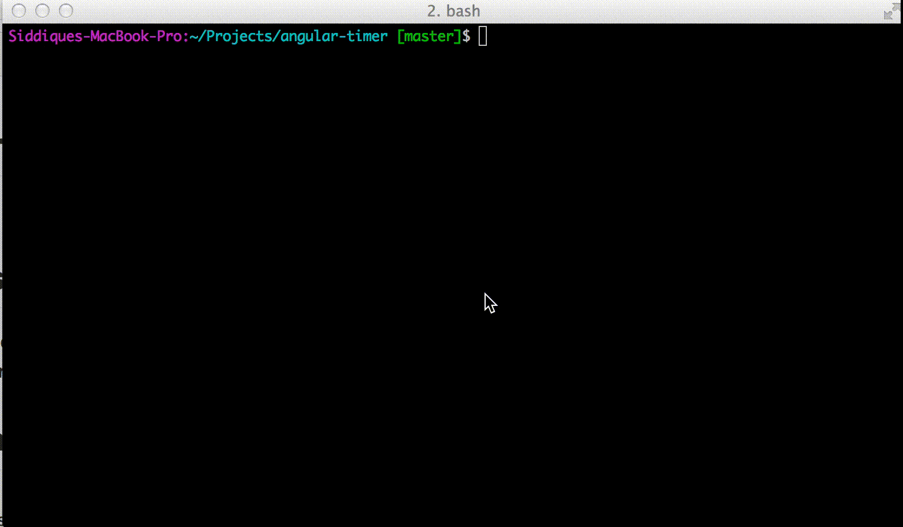

bash-utils
=====
Collection of bash utilities for GIT & other command line goodies!

##Demo


##Installation

```bash
curl https://raw.githubusercontent.com/siddii/bash-utils/master/install.sh | sh
```

##Credits

The source code in this repository are collected from various sources.
Please refer to the individual script files for their origin. Thanks to those contributors for making this possible :)
